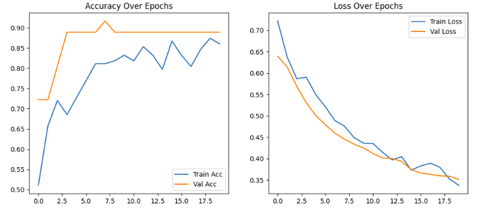
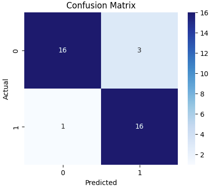
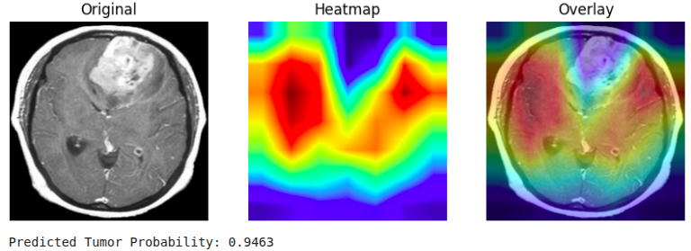

# 🧠 Brain Tumor Classification using CNN

This project implements a **Convolutional Neural Network (CNN)** for **Brain Tumor Classification** from MRI scans.  
It classifies brain MRI images into **two categories** — `Tumor` and `No Tumor`.

---

## 📘 Dataset

**Source:** [Brain MRI Images for Brain Tumor Detection](https://www.kaggle.com/datasets/navoneel/brain-mri-images-for-brain-tumor-detection)  
**Author:** Navoneel Chakrabarty  
**License:** Kaggle Dataset (Updated 6 years ago)

The dataset contains **brain MRI images** labeled as:
- `yes` — MRI scan contains a brain tumor  
- `no` — MRI scan does not contain a tumor  

Each image is preprocessed and resized to a uniform shape before being fed into the model.

---

## ⚙️ Model Overview

The project uses a **custom CNN architecture** built from scratch using TensorFlow and Keras.  
The network consists of:

- **Convolutional Layers** — to extract spatial and edge features  
- **MaxPooling Layers** — to downsample and retain important features  
- **Dropout Layers** — to reduce overfitting  
- **Fully Connected Dense Layers** — for binary classification (`Tumor` / `No Tumor`)  

The model was trained on an NVIDIA **Tesla P100 GPU (16 GB)** with **XLA optimization** enabled.

## 🧩 Model Architecture

- **Base Model:** `EfficientNetB0` (from `keras.applications`)
- **Top Layers:**
- Global Average Pooling
- Dense(256, activation='relu')
- Dropout(0.5)
- Dense(1, activation='sigmoid')
- **Optimizer:** Adam (learning rate = 1e-4 initially, 1e-5 during fine-tuning)
- **Loss Function:** Binary Crossentropy
- **Metrics:** Accuracy

---

## 📈 Results & Visualization

### **1. Accuracy and Loss Curves**

These plots show training vs validation accuracy and loss over epochs.

- Training accuracy gradually improved to **~94%**
- Validation accuracy stabilized around **~91%**
- Both training and validation loss decreased steadily

---

### **2. Confusion Matrix**

Displays the number of correctly and incorrectly classified MRI scans.

| Metric | Value |
|---------|--------|
| Precision | High (~0.90+) |
| Recall | High (~0.88+) |
| F1-score | ~0.89 |

Model correctly classifies most tumor and non-tumor images.

---

### **3. Grad-CAM Heatmaps**

Grad-CAM visualizations highlight **tumor regions** the model focuses on when making predictions.

#### 🔥 Original + Heatmap Overlay

These show that the model accurately identifies tumor areas with **high confidence**.

---

## 🚀 How to Run the Project

You can run the entire notebook directly on **Kaggle**:

1. Open the Kaggle Notebook editor.
2. Upload this notebook.
3. Add the dataset:  
 > “Brain MRI Images for Brain Tumor Detection” by Navoneel Chakrabarty  
4. Run all cells sequentially.

---

## 🧪 Technologies Used

| Library | Purpose |
|----------|----------|
| TensorFlow / Keras | Model training & architecture |
| OpenCV | Image preprocessing |
| Matplotlib | Visualization (accuracy/loss, Grad-CAM) |
| Pandas & NumPy | Data handling |
| scikit-learn | Evaluation (confusion matrix, metrics) |

---

## 🧾 Observations

- The model performs **strongly** on the limited dataset.  
- Validation accuracy is slightly lower due to small validation sample size.
- Model generalizes well and highlights tumor regions effectively.
- Increasing dataset diversity and applying stronger regularization (dropout, early stopping) can further improve results.

---

## 🧠 Conclusion

This project demonstrates how **transfer learning** can be effectively used for **medical image classification** with limited data.  
The model achieves high accuracy and provides **interpretable Grad-CAM heatmaps** that align with tumor regions in MRI scans.

> ✅ **Final Model Accuracy:** ~91–92% (Validation)  
> ✅ **Task:** Binary Brain Tumor Classification  
> ✅ **Framework:** TensorFlow / Keras  

---

